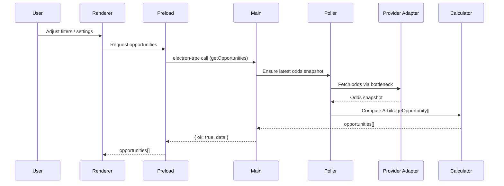

# Architecture: Arbitrage Finder App

## Executive Summary

The **Arbitrage Finder App** ("Signal Generator") is a high-performance
**Windows 11 desktop application** engineered for bettors requiring
instant identification of **risk-free betting opportunities
(surebets)**.

The architecture is built around:

-   **Utility over beauty** → maximize throughput, minimize latency\
-   **Strict typing** → predictable state and stable pipelines\
-   **Adapter-based providers** → API-agnostic, easy to extend\
-   **Keyboard-driven UI** → for speed and real-time workflows

The system consists of:

-   **Electron Main Process** → core logic, storage, adapters\
-   **Renderer Process (React)** → UI, signal preview, table\
-   **Preload Bridge** → secure, typed IPC\
-   **Shared Contracts** → ensure type alignment

------------------------------------------------------------------------

# Project Initialization

### Initial Setup

``` bash
# Initialize project using electron-vite (React + TS)
npm create electron-vite@4.0.1 arbitrage-finder -- --template react-ts

cd arbitrage-finder

# Setup UI system
npx shadcn-ui@0.9.5 init

# Install core dependencies (see Version Governance Table for exact versions)
npm install zustand electron-trpc bottleneck zod electron-store electron-log date-fns clsx tailwind-merge
```

Starter template: `electron-vite` **4.0.1** (PROVIDED BY STARTER).  
Verification search term: `"electron-vite react-ts"` on npm and GitHub.

### This establishes the base architecture with:

  ------------------------------------------------------------------------
  Category              Decision                         Rationale
  --------------------- -------------------------------- --------------------------
  Framework             **Electron-Vite 4.0.1**          Fast, clean separation of
                                                         Main/Renderer (PROVIDED BY STARTER)

  State                 **Zustand 5.0.8**                Micro-store, extremely
                                                         fast updates

  IPC                   **electron-trpc 0.7.1**          End-to-end type safety

  Secure Storage        **safeStorage**                  Uses Windows Credential
                                                         Manager

  Rate Limiting         **bottleneck 2.19.5**            Strict provider API
                                                         enforcement

  Validation            **Zod 4.1.12**                   Protection against schema
                                                         drift

  Logging               **electron-log 5.4.3**           Separate logs per process

  Dates                 **date-fns 4.1.0**               Small, immutable, modular
  ------------------------------------------------------------------------

------------------------------------------------------------------------

# Project Structure

    arbitrage-finder/
    ├── src/
    │   ├── main/
    │   │   ├── index.ts
    │   │   ├── store.ts
    │   │   ├── adapters/
    │   │   │   ├── base.ts
    │   │   │   ├── odds-api-io.ts
    │   │   │   └── the-odds-api.ts
    │   │   ├── services/
    │   │   │   ├── poller.ts
    │   │   │   └── calculator.ts
    │   │   └── router.ts
    │   │
    │   ├── preload/
    │   │   └── index.ts
    │   │
    │   ├── renderer/
    │   │   ├── src/
    │   │   │   ├── components/
    │   │   │   ├── features/
    │   │   │   │   ├── dashboard/
    │   │   │   │   │   ├── FeedTable.tsx
    │   │   │   │   │   └── SignalPreview.tsx
    │   │   │   │   └── settings/
    │   │   │   ├── stores/
    │   │   │   ├── hooks/
    │   │   │   └── lib/
    │   │   ├── index.html
    │   │   └── main.tsx
    │   │
    │   └── shared/
    │       ├── types.ts
    │       └── schemas.ts
    │
    ├── electron.vite.config.ts
    └── package.json

------------------------------------------------------------------------

# Data Architecture

``` ts
interface ArbitrageOpportunity {
  id: string;
  sport: string;
  event: { name: string; date: string; league: string };
  legs: [
    { bookmaker: string; market: string; odds: number; outcome: string },
    { bookmaker: string; market: string; odds: number; outcome: string }
  ];
  roi: number;
  foundAt: string;
}
```

### Data Model Scope and Growth

- The core data model for this app is `ArbitrageOpportunity`, which represents **ephemeral, real-time surebet signals** rather than a long-term trading ledger.
- Additional fields MAY be added over time to support UX needs (e.g. confidence scores, tags, user notes), but must preserve the invariant that each record is self-contained and derived from a specific odds snapshot.
- Historical or derived analytics (e.g. ROI over time, provider reliability metrics) should be modeled as **separate view models** or tables rather than overloading `ArbitrageOpportunity` with cross-snapshot state.

### Persistence Strategy and Deferred Database Decision (D-DB-001)

- For v1, this architecture intentionally avoids introducing a general-purpose database: real-time opportunities are kept in memory, secrets are stored via Windows safeStorage, and non-secret preferences are stored via `electron-store` (see Caching and Persistence).
- **No historical arbitrage data is persisted by default**; users interact with the current opportunity set only. This keeps complexity low and aligns with the "signal generator" goal.
- If future PRDs introduce requirements for **historical analytics or long-lived user data**, the recommended baseline is:
  - Use a local **SQLite** database located under `app.getPath("userData")`.
  - Access it through a thin TypeScript repository layer (e.g. using a lightweight driver such as `better-sqlite3`), keeping SQL out of UI and adapter layers.
  - Model historical odds snapshots and realized bets as separate tables, keyed by provider, sport, league, event, and timestamp.
- This future database introduction is treated as a **deferred decision D-DB-001** and MUST be explicitly revisited (and documented in this section) before any persistence beyond preferences and logs is implemented.

------------------------------------------------------------------------

# Security and API Credential Handling

### Security Objectives

- Keep provider API keys and secrets strictly out of the renderer process and front-end state.
- Use Windows 11 facilities (via Electron `safeStorage`) as the single source of truth for persisted secrets.
- Ensure that logs, crash reports, and test fixtures never contain raw credentials.

### Current Credential Storage Implementation (Story 1.2)

- Store configuration:
  - Uses an `electron-store` instance named `credentials` (`projectName: "arbitrage-finder"`).
  - Schema (`StorageSchema`) contains:
    - `providerSecrets: Record<providerId, string>` �+' per-provider credential tokens.
    - `fallbackWarningShown?: boolean` �+' tracks whether the fallback-mode UX warning has been acknowledged.
- Value encoding and prefixes:
  - When `safeStorage.isEncryptionAvailable()` is `true` (happy path):
    - API keys are encrypted via `safeStorage.encryptString(apiKey)`.
    - The encrypted bytes are stored as base64 with `enc:` prefix: `enc:<base64-safeStorage-payload>`.
  - When `safeStorage` is unavailable (fallback path):
    - API keys are encoded as UTF-8 and then base64, without OS-backed encryption.
    - Values are stored with a `b64:` prefix: `b64:<base64-utf8-api-key>`.
  - `isUsingFallbackStorage()` inspects `providerSecrets` and returns `true` if **any** value starts with `b64:`.
- UX behavior and warning semantics:
  - The Settings / Provider Configuration UI calls a typed IPC route backed by:
    - `getStorageStatus` �+' returns `{ isUsingFallbackStorage, fallbackWarningShown }`.
    - `acknowledgeFallbackWarning` �+' sets `fallbackWarningShown = true`.
  - When `isUsingFallbackStorage === true` and `fallbackWarningShown !== true`:
    - The UI surfaces a prominent, one-time warning explaining that credentials are stored with reversible base64 rather than OS-backed encryption and that this mode is intended only for development or low-risk environments.
    - After the user acknowledges the warning, `fallbackWarningShown` is set and subsequent sessions suppress the noisy banner while still reflecting that fallback mode is active.
- Security considerations:
  - Even in fallback mode, API keys:
    - Never appear in renderer logs or global UI state.
    - Are accessed only through the main-process storage module and typed IPC procedures (`saveApiKey`, `getApiKey`).
  - Future hardening stories can:
    - Migrate existing `b64:` entries to `enc:` when `safeStorage` becomes available.
    - Narrow renderer access to non-sensitive status (e.g., `isConfigured` flags) instead of raw keys.

### API Key Flow and Boundaries

- **Renderer (React)**
  - Users enter provider API keys only in the **Settings** / **Provider Configuration** screens.
  - Keys are held in local component state just long enough to submit, and are never stored in global state (no Zustand store, no URL params, no localStorage).
  - The renderer calls typed IPC routes (Story 1.2: TRPC procedures such as `saveApiKey` / `getApiKey`) and then immediately clears the in-memory field; the UI should treat returned keys as configuration status only, not as displayable secrets.

- **Preload Bridge**
  - Exposes a narrow, typed `credentials` surface to the renderer via `contextBridge` (e.g. `saveApiKey`, `isProviderConfigured`).
  - Does **not** expose any method that returns the raw API key to the renderer; only boolean/configuration status is returned.
  - All IPC messages are defined in shared TypeScript contracts under `shared/types.ts` / `shared/schemas.ts` and validated with Zod.

- **Electron Main Process**
  - Implements `credentials.saveApiKey` by encrypting and storing keys with `safeStorage` and a provider-specific key name (Story 1.2: `saveApiKey` and `getApiKey` in `src/main/services/storage.ts`, exposed via TRPC).
  - Adapters retrieve API keys inside the main process only (never in preload/renderer) via a `credentials.getApiKey(providerId)` helper or equivalent main-process function.
  - Adapters attach API keys to outbound HTTP requests in memory only; keys are not written to disk beyond the secure store.

### Security Invariants

- API keys and secrets:
  - Never appear in renderer logs, Redux/Zustand state, localStorage, or query strings.
  - Never cross IPC boundaries in plain text except on initial entry from the settings form to main via a typed, single-purpose procedure.
  - Are always stored and loaded through a small `credentials` module in `src/main`, not scattered across adapters.
- Provider adapters accept a **token provider function** rather than raw keys; this makes it easier to audit credential usage and refresh logic.

### Backlog Hooks

- Add a **security hardening** story that implements the `credentials` module, preload boundary, and adapter integration as described here.
- Add tests (unit + IPC contract) that explicitly assert: keys are not logged, not exposed to renderer, and are retrievable only in main.

------------------------------------------------------------------------

# Error Handling, Logging, and Observability

### Error Categories

- **UserError** – invalid configuration, missing API key, impossible filters, etc.
- **ProviderError** – HTTP 4xx/5xx, timeouts, malformed payloads from external odds APIs.
- **SystemError** – uncaught exceptions, invariant violations, parsing failures inside our code.
- **InfrastructureError** – local network issues, disk full, OS-level problems.

All public IPC procedures (`electron-trpc` routes) should return a discriminated result shape, e.g.:

- `{"ok": true, "data": T}` for success.
- `{"ok": false, "error": { "category": "ProviderError" | "UserError" | "SystemError" | "InfrastructureError", "code": string, "message": string, "details"?: unknown, "correlationId": string }}` for failures.

### Logging with `electron-log`

- **Main process logging**
  - Centralizes logging of adapter calls, poller activity, calculator operations, and credential access (without secrets).
  - Uses structured log messages with fields: `timestamp`, `level`, `context` (e.g. `"adapter:odds-api-io"`), `operation`, `correlationId`, `providerId`, `durationMs`, and `errorCategory` when applicable.
  - Logs one event per external call (success or failure) and one event per poller tick with summary statistics.

- **Renderer logging**
  - Logs UX-level events (filter changes, copy actions, settings updates) with minimal payloads (no odds data or keys).
  - Uses the same `correlationId` when possible to link UI events to backend operations.

### Observability Patterns

- **Health and heartbeat**
  - `poller.ts` emits periodic heartbeat events (e.g. `"poller.heartbeat"`) recording last successful fetch time and per-provider status.
  - The renderer subscribes to a lightweight status stream (via IPC) and surfaces **staleness indicators** when data exceeds freshness thresholds defined in the PRD/test design.

- **Error surfacing to UX**
  - Provider-level failures (e.g. one bookmaker down) are surfaced as non-blocking banners and per-provider status chips, not as modal blockers.
  - System-level failures (e.g. calculator crash) trigger a top-level error strip and prompt to restart or check logs.
  - User errors (invalid filters, missing keys) are shown inline near the relevant control with actionable guidance.

- **Log hygiene**
  - All logging utilities include automatic **redaction** for values tagged as `secret` (API keys, tokens, credentials).
  - Test suites include log-scrubbing checks that fail if secrets appear in captured logs.

### Backlog Hooks

- Add stories for:
  - Structured logging in main and renderer following the fields above.
  - Heartbeat/staleness indicator plumbing from `poller.ts` to the dashboard.
  - A minimal “view logs” affordance for troubleshooting (even if initially just linking to log file location).

------------------------------------------------------------------------

# Version and Dependency Governance

### Goals

- Make versions for core technologies **explicit, reproducible, and auditable**.
- Avoid unpinned `latest` dependencies for anything on the critical path.

### Version Sources

- **Runtime and shell**
  - Node.js: pinned to a specific LTS major (e.g. `Node 20.x LTS`) in tooling configuration.
  - Electron runtime: pinned via `package.json` and documented here.

- **Core libraries**
  - `electron-vite`, React, `zustand`, `electron-trpc`, `bottleneck`, `zod`, `electron-store`, `electron-log`, `date-fns`, `clsx`, `tailwind-merge` are all pinned in `package.json` with caret ranges (e.g. `^X.Y.0`).

### Version Governance Table

At the start of each implementation phase (and before significant upgrades), update the following table using package registry search and release notes:

  ------------------------------------------------------------------------
  Technology        Version       Verification Date   Notes
  ----------------- ------------- ------------------- ---------------------
  Node.js (LTS)     24.11.1       2025-11-20          LTS "Krypton" (nodejs.org/dist index)
  Electron-Vite     4.0.1         2025-11-20          npm view electron-vite@4.0.1
  Electron          39.2.3        2025-11-20          npm view electron@39.2.3
  React             19.2.0        2025-11-20          npm view react@19.2.0
  Zustand           5.0.8         2025-11-20          npm view zustand@5.0.8
  electron-trpc     0.7.1         2025-11-20          npm view electron-trpc@0.7.1
  Zod               4.1.12        2025-11-20          npm view zod@4.1.12
  Bottleneck        2.19.5        2025-11-20          npm view bottleneck@2.19.5
  electron-store    11.0.2        2025-11-20          npm view electron-store@11.0.2
  electron-log      5.4.3         2025-11-20          npm view electron-log@5.4.3
  date-fns          4.1.0         2025-11-20          npm view date-fns@4.1.0
  clsx              2.1.1         2025-11-20          npm view clsx@2.1.1
  tailwind-merge    3.4.0         2025-11-20          npm view tailwind-merge@3.4.0
  shadcn-ui         0.9.5         2025-11-20          npm view shadcn-ui@0.9.5
  ------------------------------------------------------------------------

### Governance Rules

- Any change to a core dependency version requires:
  - Updating `package.json` and this table.
  - Re-running a minimal **smoke suite** (golden data and rate-limit stress tests) before shipping.
- Avoid mixing LTS and non-LTS runtimes; prefer LTS for Node/Electron unless a compelling feature requires otherwise.
- For any **major version** upgrade (e.g. Node, Electron, React, electron-vite), review official release notes and record any application-impacting breaking changes in the table's Notes column.
- Baseline note (2025-11-20): review of release notes for the versions in this table did not identify any breaking changes that require architecture changes for this project; if future reviews find relevant breaking changes, capture the impact explicitly in the Notes column.

### Backlog Hooks

- Add a recurring “version review” task (e.g. once per release) to:
  - Refresh this table.
  - Re-run the golden/calibration tests for rate limiting and arbitrage correctness.

------------------------------------------------------------------------

# Implementation Patterns

### Naming Patterns

- React components use `PascalCase` file and export names, e.g. `FeedTable.tsx`, `SignalPreview.tsx`.
- Feature folders live under `renderer/src/features/{feature-name-kebab}/`; nested components keep `PascalCase` filenames.
- Hooks are named `useXxx` and stored as `useXxx.ts` or `useXxxFoo.ts` in `renderer/src/hooks` or the feature's `hooks/` folder.
- Zustand stores are named `use{Feature}Store.ts` in `renderer/src/stores` or the feature's `stores/` folder.
- Main-process services live in `src/main/services/{noun}.ts` (e.g. `poller.ts`, `calculator.ts`).
- Provider adapters live in `src/main/adapters/{provider-id}.ts` (e.g. `odds-api-io.ts`, `the-odds-api.ts`).
- Shared contracts live in `shared/types.ts` and `shared/schemas.ts` using `PascalCase` types and `camelCase` fields.
- If HTTP APIs or database tables are added later:
  - API routes follow `/api/{resource-kebab}/{action-kebab}`.
  - Tables use `snake_case` plural nouns, e.g. `arb_opportunities`, `providers`.

### Structure Patterns

- Main-process business logic lives under `src/main/**`; preload and renderer contain no direct provider or credential logic.
- Renderer code lives under `renderer/src/**` with:
  - `components/` for reusable presentational components.
  - `features/{feature-name}/` for feature modules, each with optional `components/`, `stores/`, `hooks/`, and `lib/`.
- Shared cross-process types and validation live in `shared/**`; renderer-only utilities stay in `renderer/src/lib/**`.
- Tests:
  - Co-locate tests next to the file under test as `{name}.test.ts` / `{name}.test.tsx`.
  - For `poller.ts` and `calculator.ts`, add additional regression tests under `src/main/__tests__/**`.

### Format Patterns

- IPC responses always use the discriminated envelope:
  - Success: `{"ok": true, "data": T}`
  - Failure: `{"ok": false, "error": { "category": string, "code": string, "message": string, "details"?: unknown, "correlationId": string }}`
- Dates and times shown in the UI use `date-fns` with format `yyyy-MM-dd HH:mm` in the user’s local timezone.
- User-facing error messages are short and actionable; detailed diagnostics are written to logs only.

### Communication Patterns

- Renderer ↔ main communication goes through `electron-trpc` routes only; do not use ad-hoc `ipcRenderer` calls.
- `poller.ts` emits heartbeats and provider status updates; the renderer subscribes to a lightweight status stream for dashboards.
- Logging metadata keys (`context`, `operation`, `providerId`, `correlationId`) are reused consistently across main and renderer logs.

### Lifecycle Patterns

- For each async fetch, represent `idle | loading | success | error` explicitly in store types; do not infer loading from `null`/`undefined`.
- Provider-level retries are implemented in `poller.ts` with bounded backoff; renderer components do not implement their own retry loops.
- Degraded and stale modes always reuse the `SystemStatus` and `ProviderStatus` enums; new features MUST NOT introduce ad-hoc boolean flags for status.

### Location Patterns

- Configuration:
  - Non-secret user preferences (filters, polling interval, UI options) are stored via `electron-store` in the main process under `app.getPath("userData")`.
- Logs:
  - Main and renderer logs are written via `electron-log` to the default log directory; the renderer never writes raw files directly.
- Features:
  - New features live under `renderer/src/features/{feature-name}`; avoid adding new top-level folders without updating this architecture.

### Consistency Patterns

- Use `camelCase` for variables and fields, `PascalCase` for types and components, and `SCREAMING_SNAKE_CASE` only for global constants.
- All user-visible dates follow `yyyy-MM-dd HH:mm`; internal logs may use ISO 8601.
- Error categories come from the defined set (`UserError`, `ProviderError`, `SystemError`, `InfrastructureError`); do not invent new categories without updating this document.
- When implementers encounter a scenario not covered by these patterns, they must extend this section before merging changes—agents should not guess conventions.

### Caching and Persistence

- In-memory odds cache:
  - `poller.ts` maintains the latest odds snapshot per provider (keyed by provider, sport, and league) and only recalculates `ArbitrageOpportunity[]` when snapshots change.
  - Renderer code reads from derived state (Zustand stores of `ArbitrageOpportunity[]`) instead of recalculating arbitrage per component.
- Disk persistence:
  - Non-secret user settings and preferences are persisted via `electron-store`; secrets remain in Windows safeStorage only.
  - By default, odds data is **not** cached to disk to avoid stale data influencing decisions; optional debug-only "replay" features may write snapshots under a clearly named subfolder.
- Cache invalidation:
  - Changing provider configuration or odds endpoints clears in-memory caches and restarts the poller.
  - App startup begins with an empty odds cache and waits for the first successful heartbeat before marking data as fresh.

### PRD-to-Architecture Mapping

- The **PRD** (`_bmad-output/prd.md`) defines core user journeys: selecting sportsbooks and sports, configuring filters, and receiving a real-time feed of surebets; the architecture maps these to:
  - `src/main/adapters/**` for each provider described in the PRD.
  - `poller.ts` for enforcing PRD-defined polling frequencies and quotas.
  - `calculator.ts` for implementing the arbitrage rules and ROI thresholds.
  - `renderer/src/features/dashboard/**` and `renderer/src/features/settings/**` for the main UX flows.
- The **Epics** (`_bmad-output/epics.md`) further decompose these journeys into implementation stories; every epic should identify its primary touchpoints in the structure tree (main, preload, renderer feature folder, shared contracts).
- When new requirements are added to the PRD, they MUST be reflected by either:
  - Extending an existing pattern in this document (e.g. adding a new provider adapter), or
  - Adding a new pattern subsection here or under High-Risk Domain Patterns.

### End-to-End Flow Diagram



This diagram is the reference for implementation and testing; any additional flows (e.g. settings save, diagnostics, or replay) must document their sequence in the same style.

### Background Processing (Future, D-BG-001)

- Today, all background work is handled by the main-process poller; there is **no separate job queue** or worker pool.
- If future requirements introduce heavier workloads (e.g. bulk history import, offline analytics, or ML-based ranking), the default approach is:
  - Run long-lived tasks in a dedicated Node worker process spawned from main, with a typed message channel (e.g. via IPC or `node:worker_threads`).
  - Persist intermediate results to the same local storage layer described in the Persistence Strategy (D-DB-001) when introduced.
  - Keep workers stateless beyond their inputs and local cache to simplify restarts and upgrades.
- This background processing strategy is tracked as deferred decision **D-BG-001** and MUST be finalized (and documented) before adding any non-trivial background jobs.

### For AI Agents (Summary)

- Before implementing a new feature, first identify the relevant sections in this document: **Project Structure**, **Implementation Patterns**, **High-Risk Domain Patterns**, and **UX Error and Degraded States**.
- Do not introduce new folders, naming schemes, or status flags: extend the existing **Naming**, **Structure**, **Lifecycle**, and **Consistency** patterns instead.
- When implementing behavior tied to PRD or Epics, cross-check `_bmad-output/prd.md` and `_bmad-output/epics.md` and update the **PRD-to-Architecture Mapping** bullets if the flow introduces new components or patterns.
- If you encounter a scenario not covered by the current patterns, you MUST add or update a pattern here (in collaboration with a human reviewer) before merging the implementation.

# High-Risk Domain Patterns

### Rate Limiting (R-001, NFR1)

- **Centralized limiter configuration**
  - `poller.ts` owns a `RateLimiterConfig` map per provider, using `bottleneck` instances created in main.
  - Configuration parameters (`minTime`, `maxConcurrent`, `reservations`) are derived from provider quotas in the PRD and documented in code comments.
  - All outbound HTTP calls from adapters **must go through** the relevant limiter; direct `fetch`/`axios` calls are not allowed.

  - **Calibration and stress patterns**
    - Implemented via `src/main/services/calibration.ts`, which reuses `poller.ts` and existing adapters to run bounded-duration synthetic polling loops per provider and log latency plus 2xx/4xx/5xx/429 counts via `electron-log`.
    - Exposed through `npm run calibrate:providers` and `npm run test:calibrate` (CI-friendly) so limiter parameters and quota safety can be tuned and enforced without touching core rate limiter code.

### Arbitrage Correctness (R-002, DATA)

- **Golden dataset**
  - Maintain a small set of **golden odds snapshots** (one per provider and a few combined scenarios) stored as JSON fixtures.
  - `calculator.ts` exposes a pure function that accepts these fixtures and produces `ArbitrageOpportunity[]` for comparison against expected results.

- **Invariants and property-based checks**
  - For each computed opportunity, enforce invariants such as: `roi >= 0`, legs reference distinct bookmakers, and implied probabilities sum to ≤ 1 within tolerance.
  - Property-based tests (as described in `_bmad-output/test-design-system.md`) exercise edge cases around extreme odds, near-zero ROI, and rounding.

### Backlog Hooks

- Add stories for:
  - Implementing the rate limiter configuration and calibration mode.
  - Creating and maintaining the golden dataset and property-based test harness for arbitrage correctness.

------------------------------------------------------------------------

# UX Error and Degraded States

### State Model

- The dashboard models overall system status and per-provider status explicitly:
  - `SystemStatus`: `OK` | `Degraded` | `Error` | `Stale`.
  - `ProviderStatus`: `OK` | `Degraded` | `Down` | `QuotaLimited` | `ConfigMissing`.

These statuses are computed from poller heartbeats, adapter errors, and configuration checks, not from ad-hoc boolean flags.

### UX Patterns

- **Provider failure**
  - If a provider enters `Down` or `QuotaLimited` state, show a non-blocking banner with provider name, last-success timestamp, and suggested action.
  - The grid clearly indicates which opportunities are based on a subset of providers (e.g. badge: “Odds-API only”).

- **Empty results after filtering**
  - Distinguish between “no current surebets” and “data unavailable or stale”:
    - Show a neutral, non-error message for legitimate empty results.
    - Show a warning-style message if data is stale or providers are failing, with a link to logs/status details.

- **Quota-driven fallback modes**
  - When rate limits are approached, `poller.ts` can transition to a **reduced-frequency mode** and mark the system as `Degraded`.
  - The UI surfaces this via a subtle status indicator and tooltip explaining that updates are slower to respect quotas.

### Backlog Hooks

- Add UX stories for:
  - Implementing provider and system status banners/badges.
  - Handling empty-result experiences for both “no data” and “stale data” cases.
  - Surfacing quota-based degradation modes in the UI, aligned with the rate-limiting behavior.

------------------------------------------------------------------------

# Practical Considerations and Migration

### Ecosystem Maturity and Starter Stability

- Core technologies (Electron, React, Node LTS, Vite, zustand, zod, date-fns, bottleneck, electron-store, electron-log) are all **widely used, well-documented, and actively maintained** in the broader JavaScript ecosystem.
- The `electron-vite` starter at version **4.0.1** is selected because it is actively maintained, has a clear release history, and aligns with the chosen Electron/Node versions.
- At each "version review" (see Version and Dependency Governance), maintainers should:
  - Check the official docs and GitHub issues for Electron, Node, and electron-vite for deprecations or breaking changes.
  - Confirm that the starter template is still recommended and supported; if it is no longer maintained, document the replacement strategy here.

### Team Size and Maintenance Complexity

- This architecture assumes a **small product team (1–3 engineers)** and is intentionally designed to avoid unnecessary complexity (no microservices, minimal infrastructure).
- Patterns that add weight (e.g. property-based testing, golden datasets, calibration modes) are concentrated in a few high-risk areas (rate limiting, arbitrage correctness) to keep day-to-day work manageable.
- If the team grows significantly or the product becomes mission-critical, consider:
  - Increasing automated test coverage following `_bmad-output/test-design-system.md`.
  - Introducing stricter code ownership for adapters, calculator logic, and credentials handling.
  - Periodically reviewing Implementation Patterns to reflect lessons learned.

### Migration Considerations

- **Multi-platform desktop**: Porting to macOS/Linux primarily involves verifying that Electron, safeStorage, and `electron-store` behave correctly on each OS; the core architecture remains unchanged.
- **Web-first UI**: If a web version is introduced, the React component tree and many Implementation Patterns can be reused, but:
  - Electron-specific concerns (preload, safeStorage, file system access) must be replaced with web-appropriate infrastructure (e.g. HTTPS APIs, OAuth, browser storage).
  - The arbitrage computation and polling logic can be moved into a shared backend service or serverless function while preserving invariants.
- **Future database-backed analytics**: When D-DB-001 is activated, the migration path is:
  - Introduce SQLite and repository abstractions as described in Data Architecture.
  - Gradually move any emergent ad-hoc persistence into the repository layer, leaving the rest of the architecture unchanged.

These considerations are intentionally documented so that future contributors can evolve the system without violating the principles established in this architecture.

------------------------------------------------------------------------

# Development Commands

``` bash
git clone <repo>
npm install
npm run dev
npm run build:win
```

Generated by BMAD Decision Architecture Workflow v1.0\
Date: November 20, 2025
